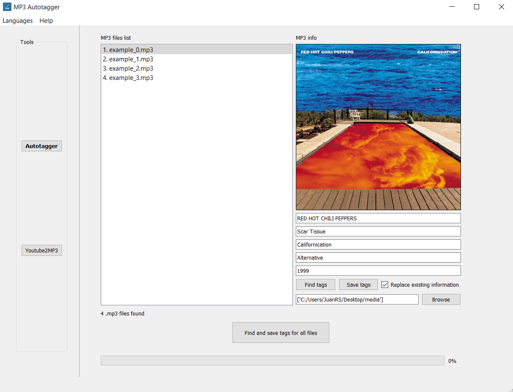
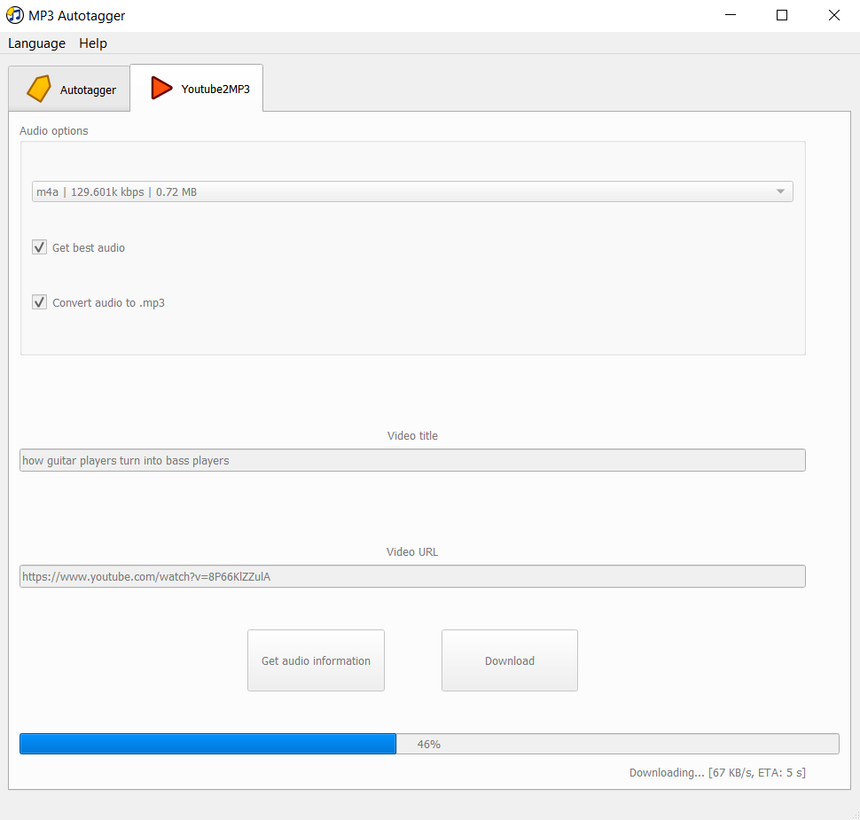

# MP3 Autotagger
 Windows application to tag  .mp3 files automatically and more.

## Tools
### MP3 autotagger
Select MP3 file/s and complete metadata information automatically.

Supported metadata:
- Artist.
- Track title.
- Album title.
- Genre.
- Release year.
- Cover.

### Youtube2MP3
Enter URL from Youtube video and download audio as an .mp3 file.

## Background
My dad wanted a tool to automatically tag all the .mp3 files from his old music library and easily download audio from Youtube videos. I developed this especifically for my dad needs only :) 

## Installation
0. Prerequisite: Install [Anaconda](https://www.anaconda.com/) and [Git for Windows](https://gitforwindows.org/) (or another Git client) if not already installed.
1. Open `Git Bash` and navigate where you want to clone the repository; then clone it using: `git clone https://github.com/jriverosesma/mp3-autotagger`.
3. Open `Anaconda Prompt` and navigate to `scripts` inside cloned repository folder.
4. Run `setup.bat`.

## Usage
1. Open Anaconda Prompt and navigate to `scripts` inside cloned repository folder.
2. Run `run.bat`.

### MP3 autotagger
1. Click on `Browse` and select .mp3 files or folders containing .mp3 files. A list of .mp3 files will show on left box.
2. Click on any track to show its current tags.
3. Replace information in fields and click on the cover to choose a new one from your images.
4. Click on `Find tags` if you want MP3 Autotagger to automatically find the tags and cover for you. Uncheck `Replace information` box to keep the original .mp3 tags that are not missing.
5. Click on `Save tags` to overwrite tags in original file. The new name of the file will be in the format `ARTIST - Title`.
- Click on `Find and save tags for all files` to automatically find and save tags for all found .mp3 files. Uncheck `Replace information` box to keep the original .mp3 tags that are not missing. A log file in the format `log_YearMonthDay_HourMinuteSecond.txt` will be saved in the `log` folder of the cloned repository at the end of the execution. The log file helps shows for each file if everything went fine when it was processed (`OK`) or not (`FAILED`).

### Youtube2MP3
1. Copy and paste URL in `Enter URL` field. 
2. Click `Get audio information` button to display audio information. Uncheck `Get best audio` before clicking on `Get audio information` to select an audio with lower quality than the best quality available. You can select a new audio quality using the combo box inside the `Audio options` area. 
3. Uncheck `Convert audio to .mp3` box to keep the original download audio format.
4. Click `Download` and wait for audio to download (and convert). You will find it in your PC `Downloads` folder.
        
## Upcoming updates
- Implement Spanish translation.

## TODO
- Testear todo -> Subir. Testear a clonar y ver comportamiento.
- Add rename file.
- Arreglar BUG de thread de Youtube.
- Check if more than one artist / track / etc...
- Shazam_out['track']['subtitle'].upper() always artist?
# MP3 Autotagger
 Windows application to tag  .mp3 files automatically and more.

## Tools
### MP3 autotagger
Select MP3 file/s and complete metadata information automatically.

Supported metadata:
- Artist.
- Track title.
- Album title.
- Genre.
- Release year.
- Cover.

### Youtube2MP3
Enter URL from Youtube video and download audio as an .mp3 file.

## Background
My dad wanted a tool to automatically tag all the .mp3 files from his old music library and easily download audio from Youtube videos. I developed this especifically for my dad needs only :) 

## Installation
0. Prerequisite: Install [Anaconda](https://www.anaconda.com/) and [Git for Windows](https://gitforwindows.org/) (or another Git client) if not already installed.
1. Open `Git Bash` and navigate where you want to clone the repository; then clone it using: `git clone https://github.com/jriverosesma/mp3-autotagger`.
3. Open `Anaconda Prompt` and navigate to `scripts` inside cloned repository folder.
4. Run `setup.bat`.

## Usage
1. Open Anaconda Prompt and navigate to `scripts` inside cloned repository folder.
2. Run `run.bat`.

### MP3 autotagger
1. Click on `Browse` and select .mp3 files or folders containing .mp3 files. A list of .mp3 files will show on left box.
2. Click on any track to show its current tags.
3. Replace information in fields and click on the cover to choose a new one from your images.
4. Click on `Find tags` if you want MP3 Autotagger to automatically find the tags and cover for you. Uncheck `Replace information` box to keep the original .mp3 tags that are not missing.
5. Click on `Save tags` to overwrite tags in original file. The new name of the file will be in the format `ARTIST - Title`.
- Click on `Find and save tags for all files` to automatically find and save tags for all found .mp3 files. Uncheck `Replace information` box to keep the original .mp3 tags that are not missing. A log file in the format `log_YearMonthDay_HourMinuteSecond.txt` will be saved in the `log` folder of the cloned repository at the end of the execution. The log file helps shows for each file if everything went fine when it was processed (`OK`) or not (`FAILED`).

### Youtube2MP3
1. Copy and paste URL in `Enter URL` field. 
2. Click `Get audio information` button to display audio information. Uncheck `Get best audio` before clicking on `Get audio information` to select an audio with lower quality than the best quality available. You can select a new audio quality using the combo box inside the `Audio options` area. 
3. Uncheck `Convert audio to .mp3` box to keep the original download audio format.
4. Click `Download` and wait for audio to download (and convert). You will find it in your PC `Downloads` folder.
        
## Upcoming updates
- Implement Spanish translation.
