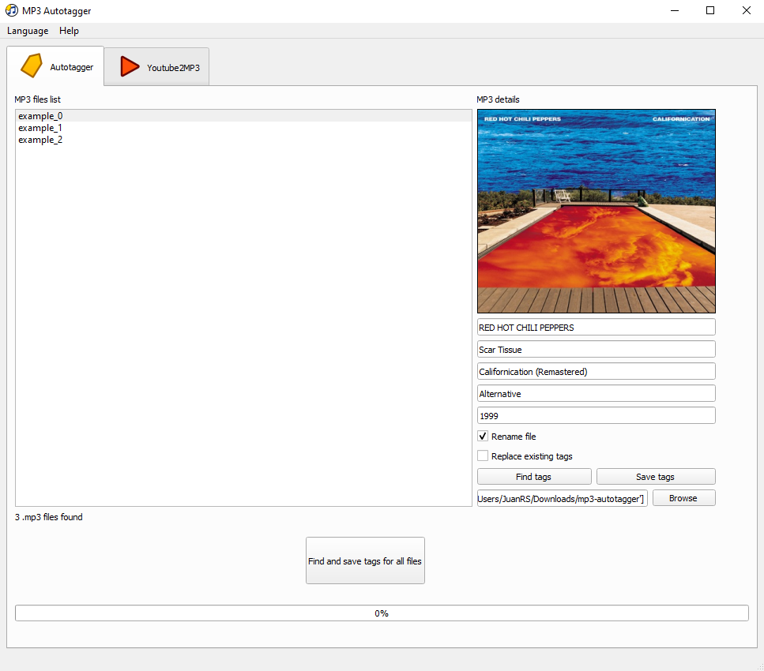

[](https://github.com/jriverosesma/mp3-autotagger/actions/workflows/unit_tests.yaml)
[](https://github.com/jriverosesma/mp3-autotagger/actions/workflows/build.yaml)
[](https://github.com/jriverosesma/mp3-autotagger/releases)
[](https://pypi.org/project/mp3-autotagger/)

# MP3 Autotagger
A simple OS independent application to tag .mp3 files automatically and more.

## Tools
### MP3 autotagger
Select MP3 file/s and complete metadata information automatically.

Supported metadata:
- Artist.
- Track title.
- Album title.
- Genre.
- Release year.
- Cover.



### Youtube2MP3
Enter URL from Youtube video and download audio as an .mp3 file.


## Background
My dad wanted a tool to automatically tag all the .mp3 files from his old music library and easily download audio from Youtube videos. I developed this especifically for my dad needs only :)

## Installation

### Python package

1. Prerequisite: Install [Miniconda](https://docs.conda.io/en/latest/miniconda.html) (more lightweight) or [Anaconda](https://www.anaconda.com/).

2. Open Anaconda Prompt and run the following commands:
```bash
conda create -y -n mp3-autotagger python=3.10 --no-default-packages
conda activate mp3-autotagger
conda install -y ffmpeg
python -m pip install --upgrade pip
pip install mp3-autotagger
```

⚠️ **Make sure to install `ffmpeg` with the above command** ⚠️

### Binary distribution

Binary distributions for Linux, Windows and macOS are available with each GitHub release as stand-alone executables [here](https://github.com/jriverosesma/mp3-autotagger/releases).

## Usage
1. Open Anaconda Prompt and run the following command to activate the conda environment: `conda activate mp3-autotagger`
2. Run the following command to launch the application: `mp3-autotagger`

### MP3 autotagger
1. Click on `Browse` and select .mp3 files or folders containing .mp3 files. A list of .mp3 files will show on left box.
2. Click on any track to show its current tags.
3. Replace information in fields and click on the cover to choose a new one from your images.
4. Click on `Find tags` if you want MP3 Autotagger to automatically find the tags and cover for you. Uncheck `Replace information` box to keep the original .mp3 tags that are not missing.
5. Click on `Save tags` to overwrite tags in original file. The new name of the file will be in the format `ARTIST - Title`.
- Click on `Find and save tags for all files` to automatically find and save tags for all found .mp3 files. Uncheck `Replace information` box to keep the original .mp3 tags that are not missing. A log file in the format `log_YearMonthDay_HourMinuteSecond.txt` will be saved in the `log` folder of the cloned repository at the end of the execution. The log file shows for each file if everything went fine when it was processed (`OK`) or if something went wrong (`FAILED`).

### Youtube2MP3
1. Copy and paste URL in `Enter URL` field.
2. Click `Get audio information` button to display audio information. Uncheck `Get best audio` before clicking on `Get audio information` to select an audio with lower quality than the best quality available. You can select a new audio quality using the combo box inside the `Audio options` area.
3. Uncheck `Convert audio to .mp3` box to keep the original download audio format.
4. Click `Download` and wait for audio to download (and convert). You will find it in your PC `Downloads` folder.
